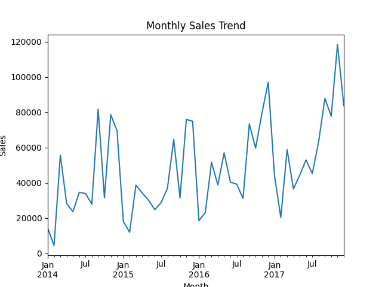
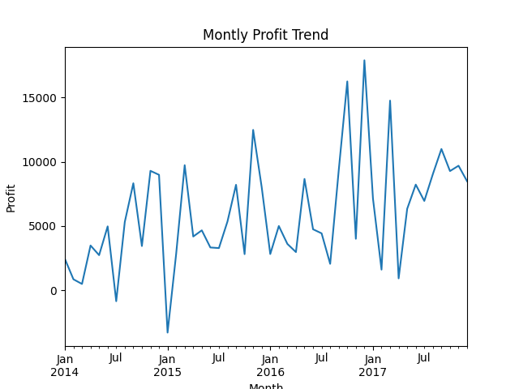
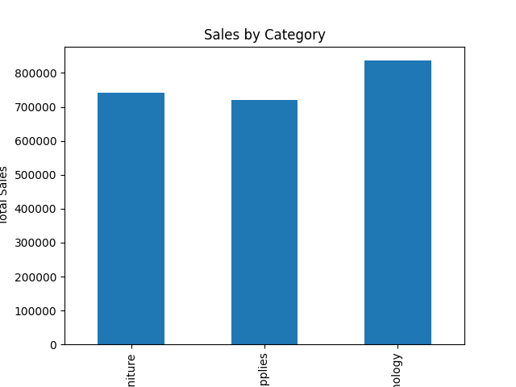
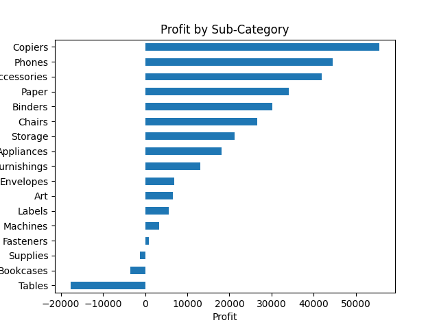

# 📊 Store Sales and Profit Analysis

## 📌 Overview
This project analyzes a retail dataset to understand sales performance, profit trends, and category-wise insights using Python.

---

## 🎯 Objectives
- Clean and preprocess the dataset
- Analyze monthly sales and profit trends
- Identify top-performing categories
- Detect loss-making sub-categories

---

## 🛠 Tools Used
- Python
- Pandas
- NumPy
- Matplotlib

---

## 🧹 Data Preparation
- Converted Order Date and Ship Date into datetime format
- Handled missing values
- Removed outliers using IQR method

---

## 📊 Analysis

### Monthly Sales Trend
- Sales analyzed month-wise
- Shows overall growth with fluctuations

### Monthly Profit Trend
- Profit variation analyzed across months

### Category Analysis
- Identifies categories contributing most to sales

### Sub-Category Analysis
- Shows profit/loss at sub-category level

---

## 📈 Key Insights
- Sales show seasonal variation
- Profit does not always follow sales
- Some categories dominate revenue
- Certain sub-categories result in losses

---

## 📊 Sample Outputs

### Monthly Sales Trend

### Monthly Profit Trend

### Sales by Category

### Profit by Sub-Category

---

## 📂 Project Structure
store-sales-analysis/
├── data/
│ └── superstore.csv
├── notebook/
│ └── analysis.ipynb
├── images/
│ ├── monthly_sales.png
│ ├── monthly_profit.png
│ ├── category_sales.png
│ └── subcategory_profit.png
└── README.md

---

## 🚀 Conclusion
This project demonstrates how data analysis can be used to understand business performance and generate actionable insights for better decision-making.